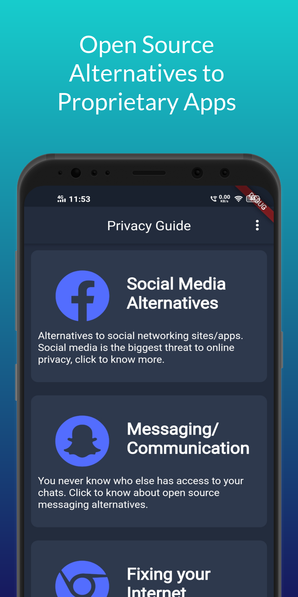
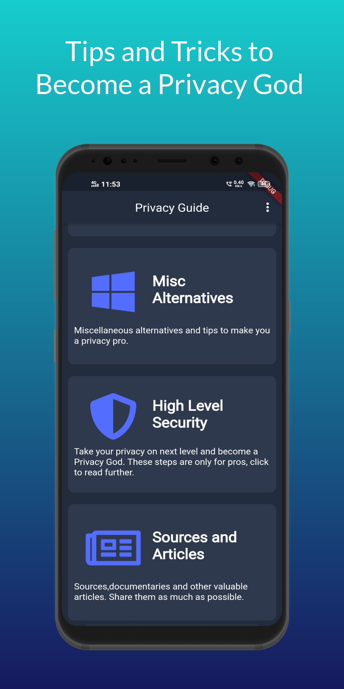
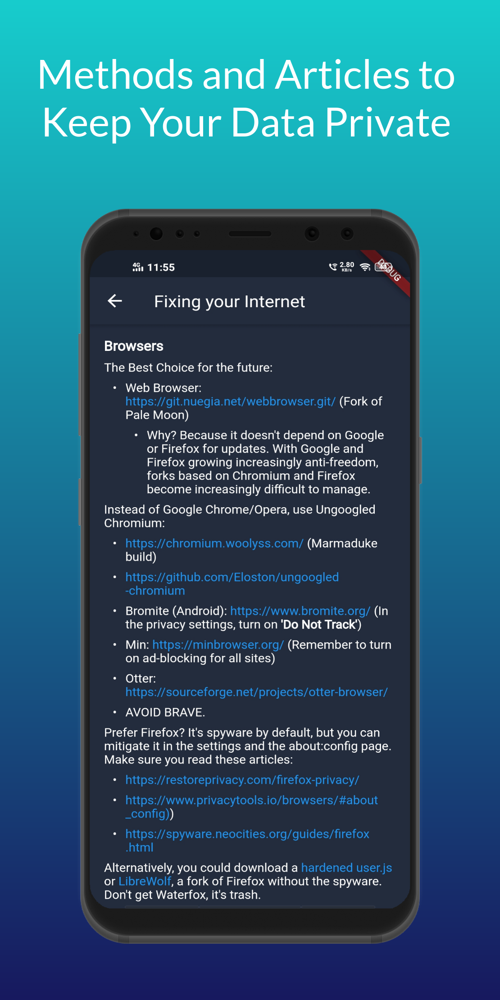
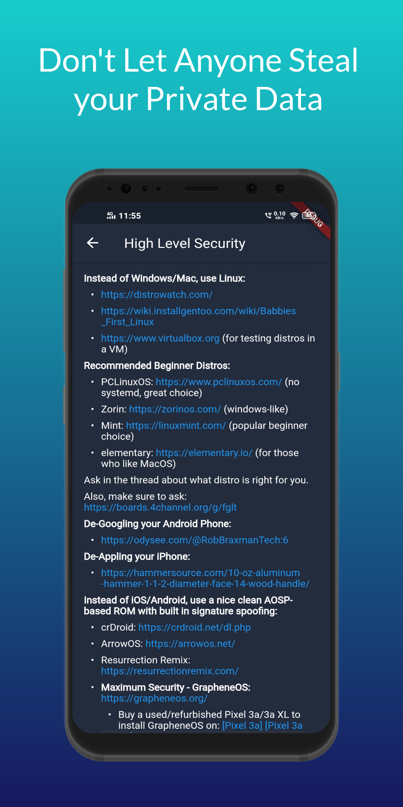

# Privacy Guide
The aim of Privacy Guide is to aware people about how and where their data is used over the internet and how they can limit/reduce the unwanted data sharing to improve their online privacy.

## Download
[Download from GetJar](https://www.getjar.com/categories/productivity-apps/security/Privacy-Guide-985152)

## Screenshots

## Technology

### Tech Stack
* Flutter SDK
* Dart Programming Language

### Dependencies
* font_awesome_flutter
* flutter_markdown
* url_launcher
